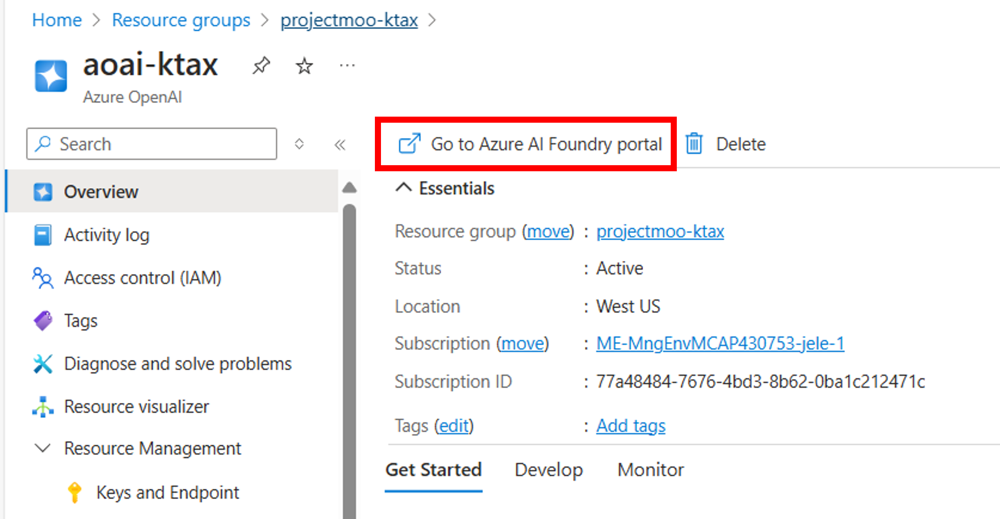
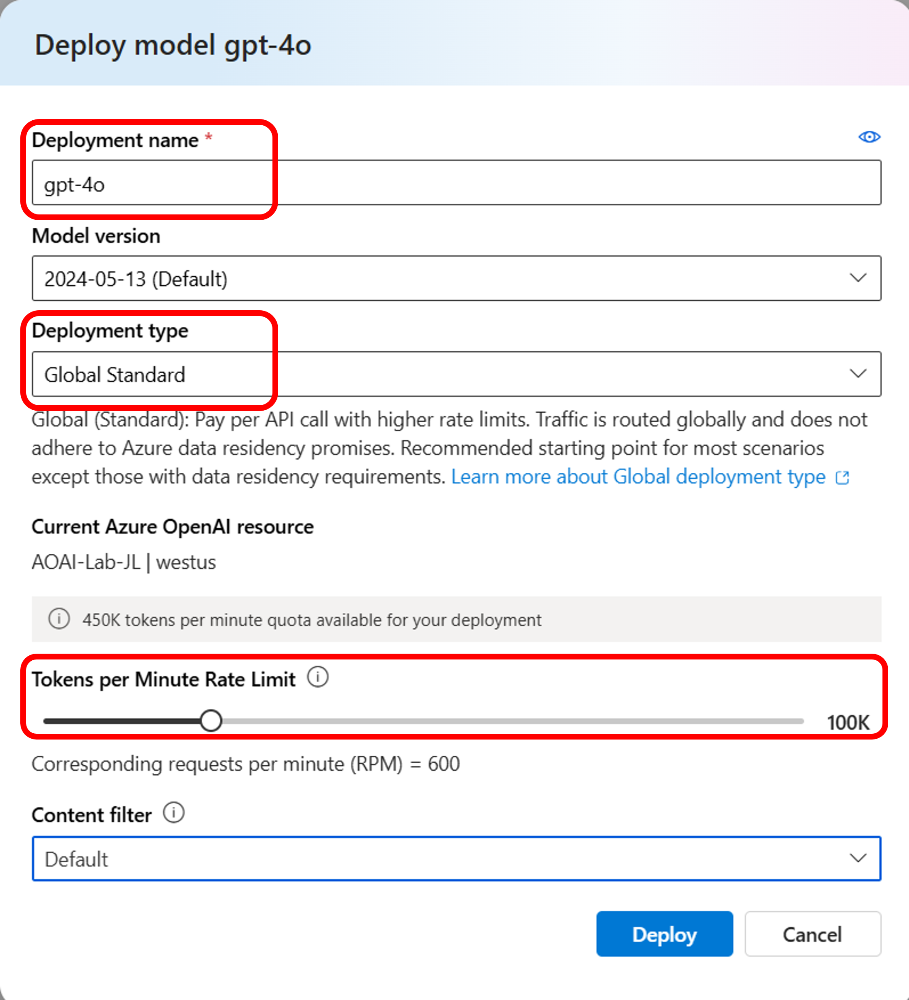

# Azure OpenAI Assistants

Azure OpenAI Assistants는 Code Interpreter, Function Calling등의 도구를 통해 사용자 맞춤형 AI 어시스턴트를 생성할 수 있게 해줍니다.

## 사전 요구 사항
* [Visual Studio Code 설치] (https://code.visualstudio.com/)

## 1. Azure AI Foundry Portal의 Assistant Playgound에서 Code interpreter 사용해보기

### Azure AI Foundry에서 Model Deployment, Assistant 생성 및 사용
1. Azure AI Foundry 리소스에서 "Go to Azure AI Foundry portal"를 클릭하여 Azure AI Foundry portal로 이동합니다.

    

2. Azure OpenAI Studio에서 Assistants Playground를 선택합니다.

    

3. Assistants Playground에서 Assistant를 생성하기 전에, 먼저 모델 배포 (Deployment)를 해야합니다. "+ Create new deployment"에서 "From base models"를 선택한 후 모델 배포를 시작합니다.

    

4. "gpt-4o" 모델을 선택합니다. gpt-4등 다른 모델을 선택하여도 되지만, 지역 및 배포타입에 따라서 선택이 되지 않을 수도 있습니다. 지역별 모델의 제공 여부는 [Azure OpenAI Service models] (https://learn.microsoft.com/en-us/azure/ai-services/openai/concepts/models?tabs=python-secure)를 참고하시기 바랍니다.

    

5. Deployment name, model version, Deployment type을 선택합니다. Deployment type은 Global Standard와 Standard 중 선택하세요. 다음 단계에서 수학 계산을 위한 Assistant를 생성할 예정이므로, Tokens per Minute Rate Limit을 올려줍니다. 모든 항목을 입력/선택 한 후에 "Deploy" 버튼을 누릅니다.

    

6. "+ New assistant"를 클릭하여 새로운 Assistant를 셋업합니다. 위에서 Deploy한 모델을 선택하고, Assistant 이름을 넣어줍니다. 수학 문제를 푸는 도움을 주는 Assistant의 예시를 테스트 할 예정이므로, "Math Assistant"라고 넣어줍니다. Instruction에는 "You are an AI assistant that can write to help answer math questions."를 적어줍니다.

    

7. Tools 메뉴에서 "Code interpreter"를 켭니다. 오른쪽 하단의 프롬프트 입력창에 "I need to solve the equation '3x + 11 = 14'. Can you help me?"를 입력합니다.

    

8. 답변이 정상적으로 오는 것을 확인합니다. Assistant를 호출하여 응답을 준 것인지는 확인하기 위하여, "Logs"를 클릭하여 로그에서 "/openai/assistants"를 호출 한 것을 확인합니다.

    

## 2. Python 코드로 Assistants 구현 해 보기

### Assistants File Search 구현 해 보기 (예상 소요시간: 10~15분)

1. 실습 개요

본 실습에서는 "/Assistants/function_calling/assistants_file_search.ipynb" 코드를 이해하고 실행해 봅니다.

먼저, 아래의 명령어로 Git Repository의 코드를 다운로드 합니다.

```
git clone https://github.com/jeongaelee/projectmoo1code.git
```

assistants_file_search.ipynb 노트북은 [Azure OpenAI Assistants (preview)의 File Search 툴](https://learn.microsoft.com/en-us/azure/ai-services/openai/how-to/file-search?tabs=python)을 이용하여 Azure OpenAI 모델 외부의 지식 (제품 정보, 사용자 제공 문서등)으로 Assistant를 보강하는 방법을 보여줍니다. OpenAI는 문서를 자동으로 구문 분석 및 청킹하고, 임베딩을 생성 및 저장하고, 벡터 및 키워드 검색을 모두 사용하여 관련 콘텐츠를 검색하여 사용자 쿼리에 답변합니다.

2. 학습 목표

이 실습의 주요 목적은 향상된 기능을 위해 LLM에서 Assistants File Search를 어떻게 사용하는지 보여주는 것 입니다.

이 실습에서 사용된 서비스:

- Azure OpenAI Service

3. 프로그래밍 언어

- Python

## 실습 순서

* [Azure OpenAI Service 시작하기](https://github.com/jeongaelee/ProjectMooModule1/blob/main/QuickStart.md)
* [Global Batch API](https://github.com/jeongaelee/ProjectMooModule1/blob/main/Batch.md)
* [Azure OpenAI On Your Data - File Upload](https://github.com/jeongaelee/ProjectMooModule1/blob/main/OnYourData-FileUpload.md)
----
* [Azure OpenAI On Your Data - Embeddings and Search](https://github.com/jeongaelee/ProjectMooModule1/blob/main/OnYourData-EmbeddingsAndSearch.md)
* [Azure OpenAI Assistants Code Interpreter, File Search 사용해보기](https://github.com/jeongaelee/ProjectMooModule1/blob/main/Assistants.md)
