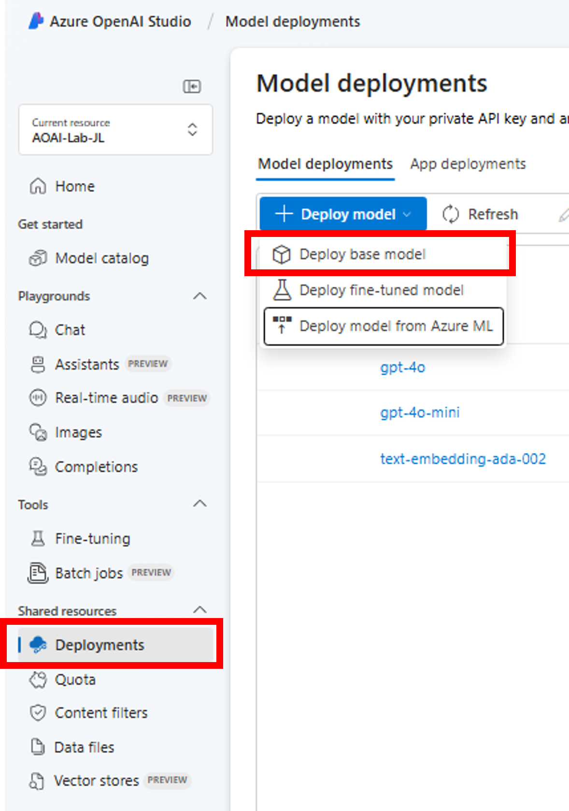
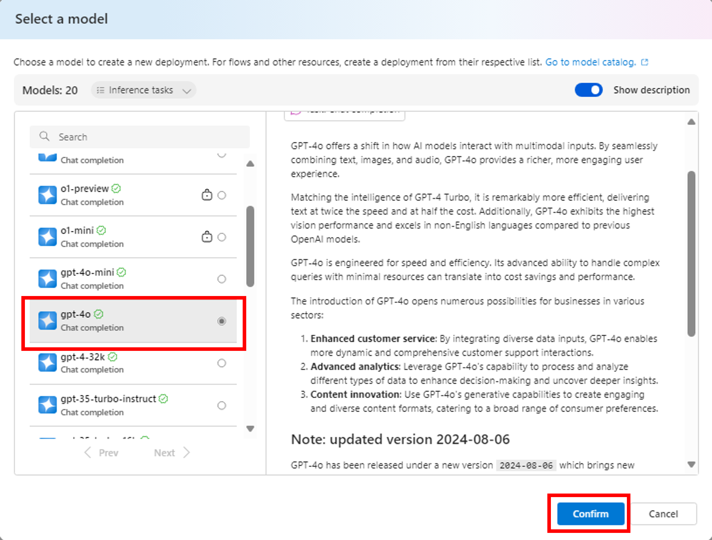
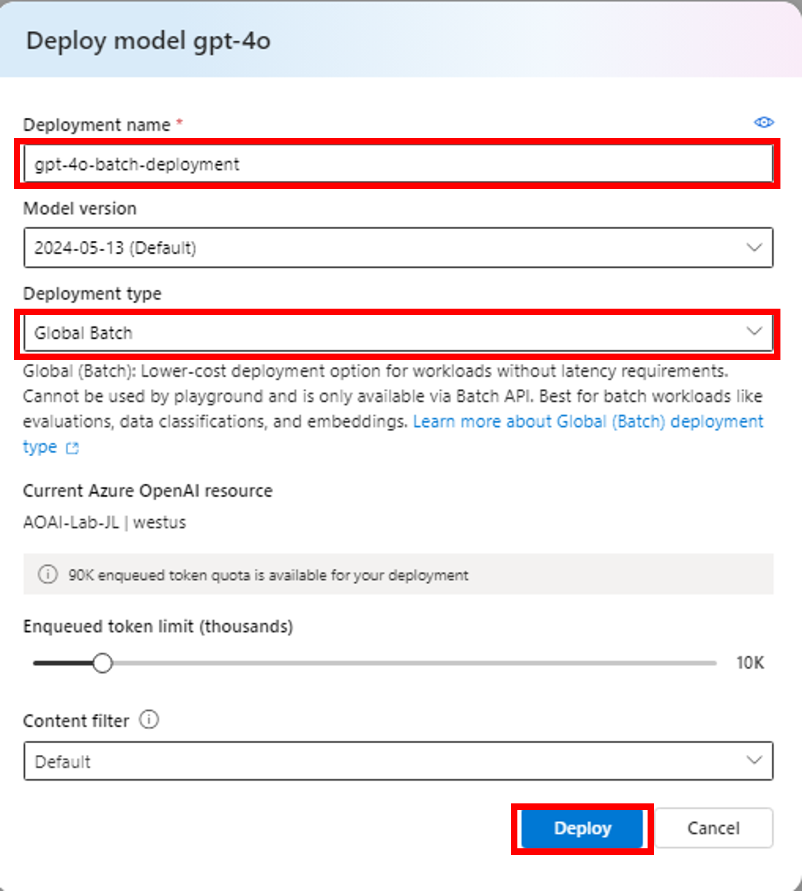
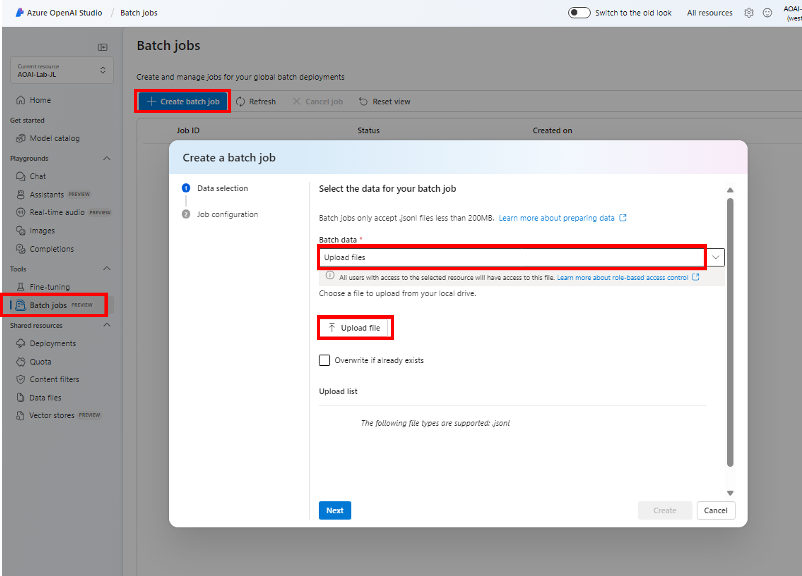
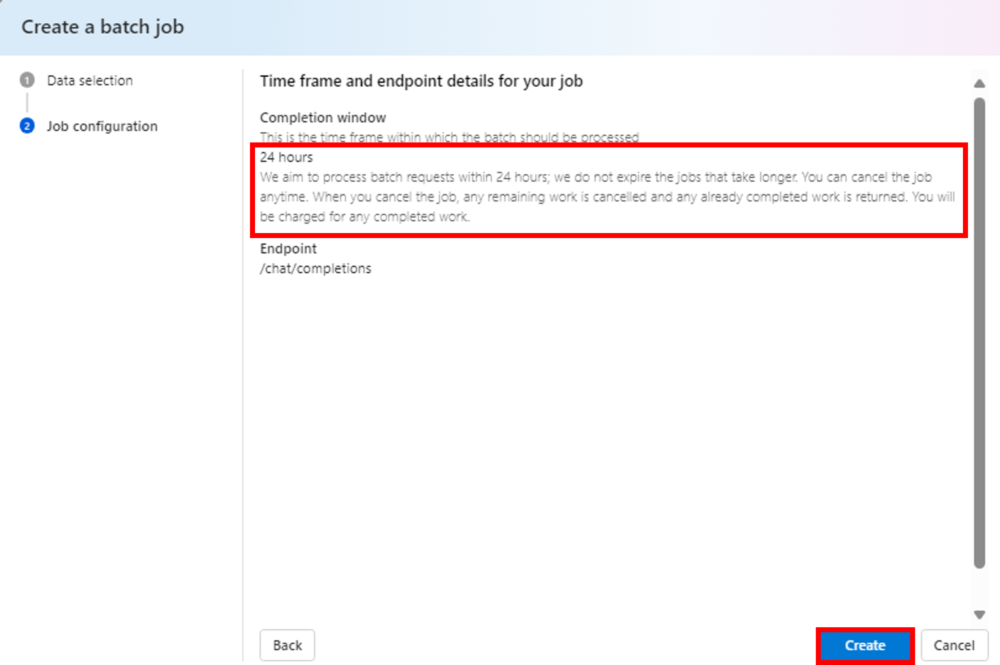
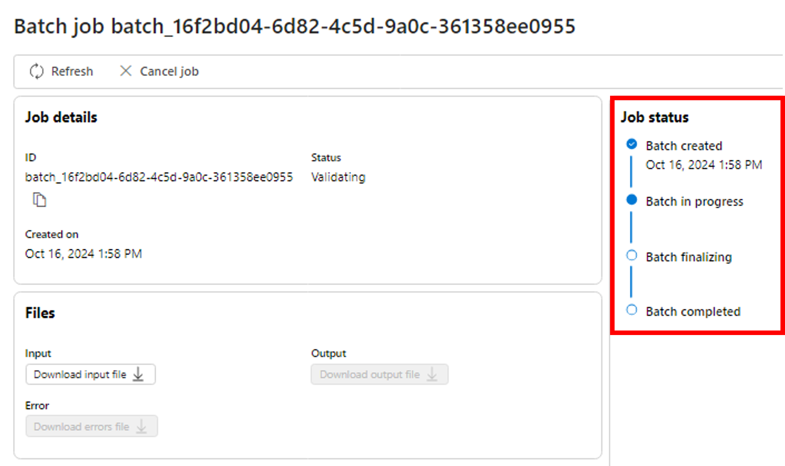
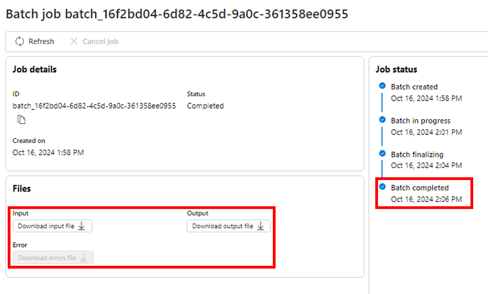

# Global Batch Deployment

Azure OpenAI의 Batch API는 대규모 및 대용량 처리 작업을 효율적으로 처리하도록 설계 되었습니다. 별도의 할당량으로 비동기 요청 그룹을 처리하고 24시간 처리를 타겟으로, 글로벌보다 50% 더 저렴한 비용을 제공합니다. Batch API를 사용하면 한 번에 하나의 요청을 보내는 것이 아니라, 단일 파일에 많은 수의 요청을 보냅니다. Global Batch 배포 요청에는 별도의 토큰 Queue가 할당 되기 때문에 온라인 워크로드가 중단되지 않습니다.

## Azure Potal에서 모델을 Global Batch 옵션으로 배포하고, Batch Job을 생성

### Azure OpenAI에서 Global Batch Job 실행

1. Azure AI Foundry Portal의 Deployments 메뉴에서 새로운 Model Deployment를 실행합니다. "+Deploy model"을 클릭하고 "Deploy base model"을 선택합니다.

    

2. 모델 선택 창에서 "gpt-4o" 모델을 선택하고 "Confirm" 버튼을 클릭합니다.

    

3. Deployment name을 "gpt-4o-batch-deployment'로 입력하고, Deployment type을 "Global Batch"로 선택한 후 "Deploy"합니다.

    

4. 왼쪽 "Tools" 메뉴의 "Batch Jobs" 메뉴를 선택합니다. "+ Create batch job"을 클릭한 후, "Upload files"를 Batch data의 항목으로 선택합니다. "Upload file"을 누른 후, 본 Repo의 Batch 폴더 아래의 "test.jsonl" 파일을 선택하여 업로드 합니다. (Global Batch는 JSON lines 파일 포멧을 사용합니다.)

    

5. Note: Batch Job은 24시간 이내 처리되는 것을 목표로 합니다. Batch Processing이 24 시간이 초과 되더라도 만료 (Expire)하지는 않습니다. Batch Job은 어느 시점에든 취소할 수 있지만, 이미 처리된 프롬프트에 대해서는 비용이 발생하고, 처리되지 않은 나머지는 취소 됩니다. 확인 후 "Create"를 클릭합니다.

    

6. Batch Job이 생성되면 실행 상태를 보실 수 있습니다. "Batch in progress"를 확인합니다.

    

7. Batch Job 실행이 완료되면 Job status가 "Batch completed"로 바뀝니다. Input 파일, Output 파일, Error 파일을 다운로드 할 수 있습니다. Output 파일을 다운로드하여 Completion이 정상적으로 응답 되었는지 확인 해 봅니다. 

    

## 실습 순서

* [Azure OpenAI Service 시작하기](https://github.com/jeongaelee/ProjectMooModule1/blob/main/QuickStart.md)
* [Global Batch API](https://github.com/jeongaelee/ProjectMooModule1/blob/main/Batch.md)
* [Azure OpenAI On Your Data - File Upload](https://github.com/jeongaelee/ProjectMooModule1/blob/main/OnYourData-FileUpload.md)
----
* [Azure OpenAI On Your Data - Embeddings and Search](https://github.com/jeongaelee/ProjectMooModule1/blob/main/OnYourData-EmbeddingsAndSearch.md)
* [Azure OpenAI Assistants Function Calling, File Search 사용해보기](https://github.com/jeongaelee/ProjectMooModule1/blob/main/Assistants.md)
* [RAG를 사용한 Python 채팅 샘플 애플리케이션](https://github.com/jeongaelee/ProjectMooModule1/blob/main/RAG.md)
