# Azure OpenAI On Your Data - Part1

Azure OpenAI의 On Your Data는 OpenAI 모델의 파워를 활용할 수 있으며, Azure의 엔터프라이즈급 보안을 적용하여 데이터에 직접 RAG 모델의 고급 기능을 통합 할 수 있습니다. 이 기능을 사용하여, 연결하고 상호 작용하고, 자체 데이터를 그라운드하는 방식을 좀 더 정확하고 빠르게 변화시킬 수 있습니다. 자체 데이터로 개인화된 Copilot을 빠르게 생성하여 사용자의 이해를 높이고, 작업을 신속하게 완료하며, 의사 결정을 도울 수 있습니다.

## 1. 자신의 데이터를 사용하여 Azure OpenAI 모델로 채팅해보기 (File Upload 옵션 사용)

### Azure 리소스 생성
1. [Azure Portal](https://portal.azure.com/)으로 접속하여 Azure Storage Account를 생성합니다.

    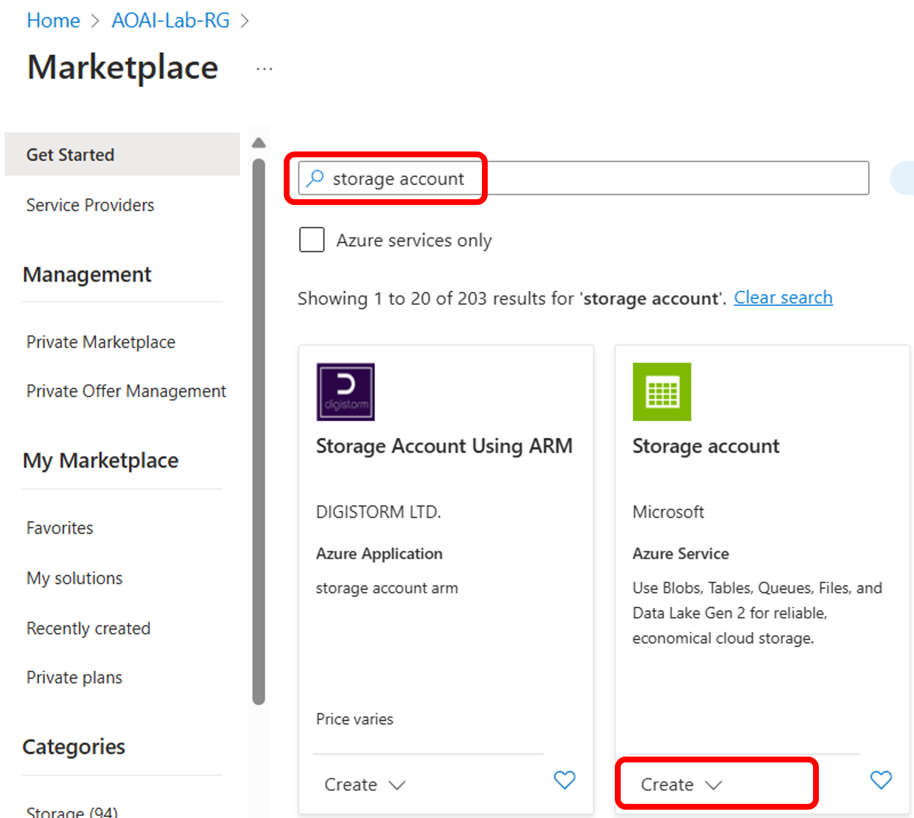

2. 이전 과정에서 생성한 리소스 그룹을 선택하고, 지역은 "West US"를 선택합니다. Primary service와 Primary workload, Performance를 아래와 같이 선택합니다. 본 실습에서는 Redundancy의 GRS 옵션은 필요하지 않으므로, Locally-redundant storage(LRS) 옵션을 선택합니다.

    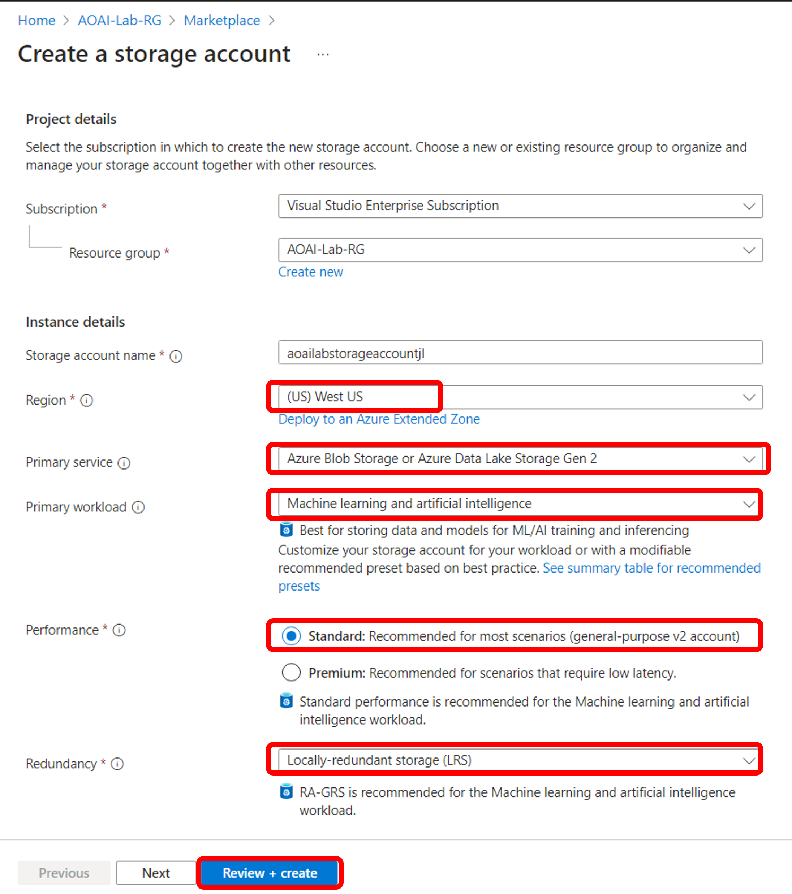

3. Advanced 탭에서 "Allow enabling anonymous access on individual containers" 항목을 enable 해줍니다. 기본적으로 Blob Container는 컨텐츠에 대한 익명 액세스를 허용하지 않습니다. 이 설정을 사용하면, 승인된 사용자가 특정 컨테이너에서 익명 액세스를 선택적으로 활성화 할 수 있습니다. 나머지 과정은 디폴트 값으로 선택 후 "Review + create"를 누릅니다.

    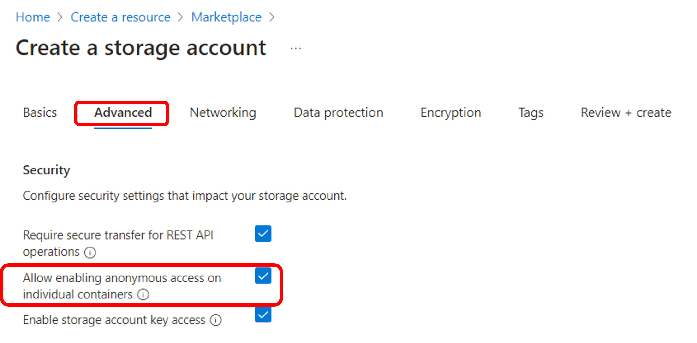

4. Azure AI Search를 생성합니다.

    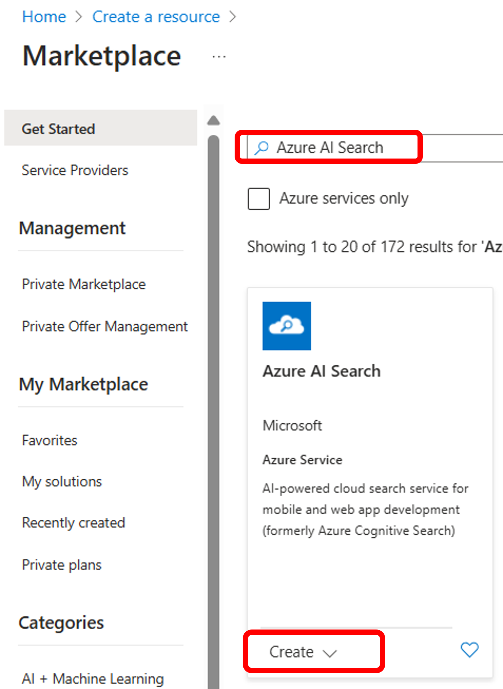

5. 지역은 "West US"로 선택하고, 가격 티어는 Basic 혹은 Standard를 선택합니다. Free 티어는 본 실습에서 사용될 On Your Data 기능을 적용할 수 없습니다.

    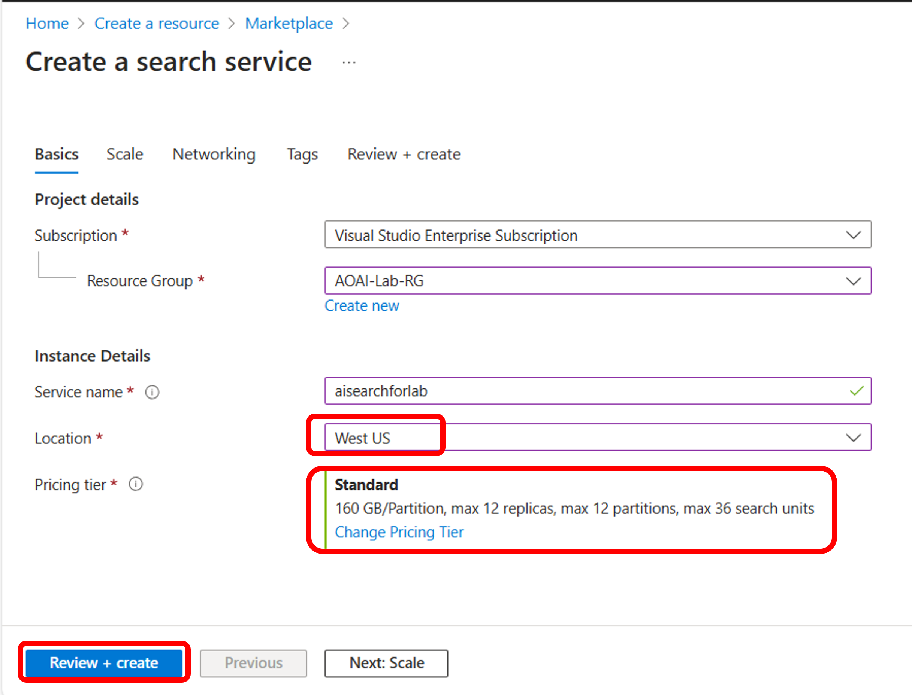

6. Azure OpenAI Studio의 Home 화면으로 이동하여 "Bring your own data"를 선택합니다.

    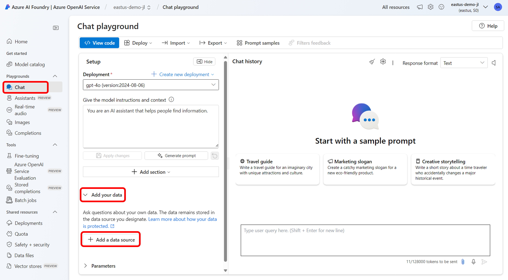

7. Chat playground에서 "Add your data" 탭을 선택한 후, "+ Add a data source"를 클릭합니다.

    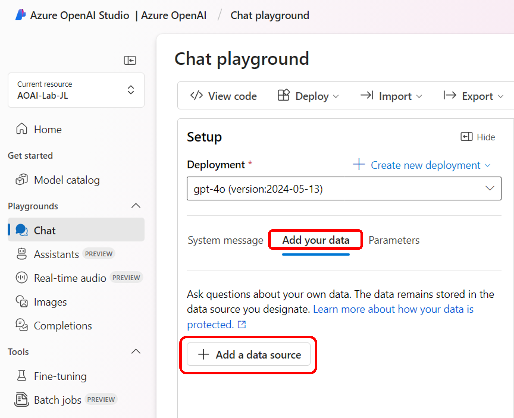

8. 이번 실습에서는 직접 파일을 업로드하여 업로드한 파일의 콘텐츠에서 채팅 응답이 생성되는지 확인해 보도록 하겠습니다. 데이터 소스를 "Upload files (preview)"를 선택하고, 위의 단계에서 생성한 Azure Blob Storage와 Azure AI Search 리소스를 선택합니다. Azure 구독의 storage account에 Azure OpenAI가 액세스 하기 위해서는 권한 부여가 필요하고, 이를 위해서 Cross-origin resource sharing (CORS)을 켜야합니다. 이 데이터 소스를 참조하는데 사용할 인덱스 이름을 입력합니다. 데이터 수집이 완료된 후 제공된 이름의 새 AI Search Index가 생성됩니다.

    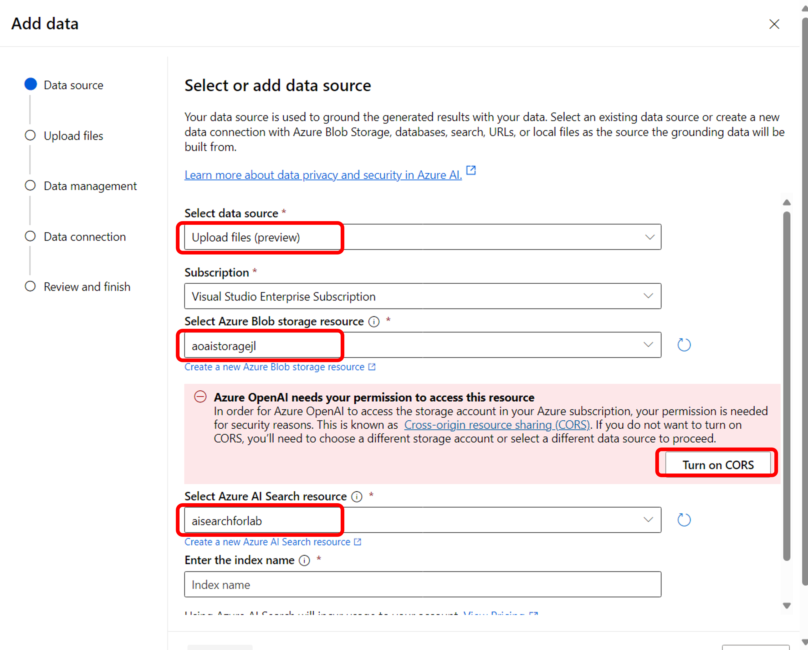

9. 업로드할 파일을 Drag and drop 한 후 "Upload files"를 클릭합니다. 본 실습에서는 "role_library.pdf" 파일을 업로드 해보도록 하겠습니다.

    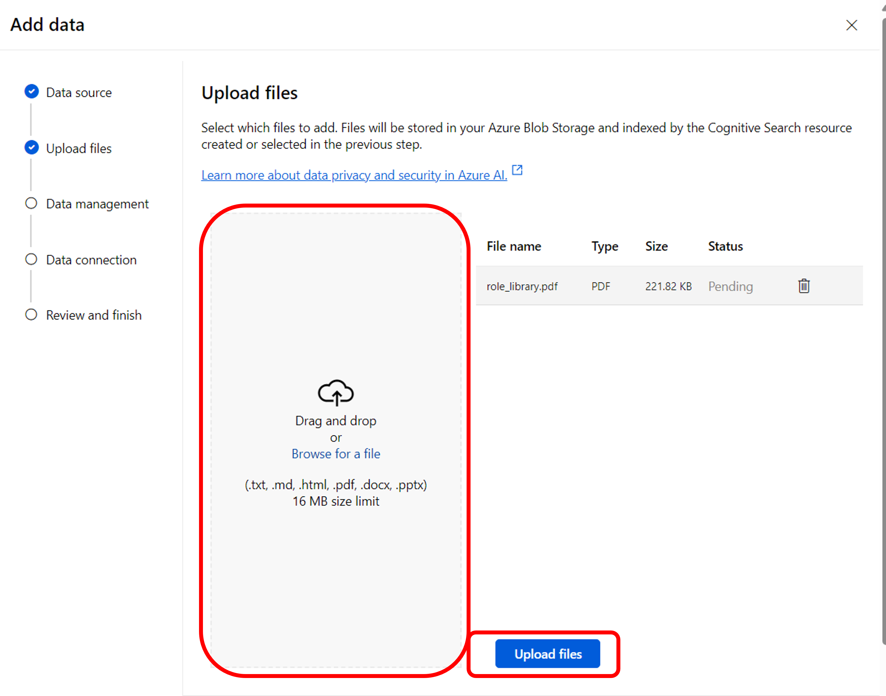

10. Search type을 "Semantic"으로 선택하고 디폴트 청킹 사이즈를 선택합니다.

    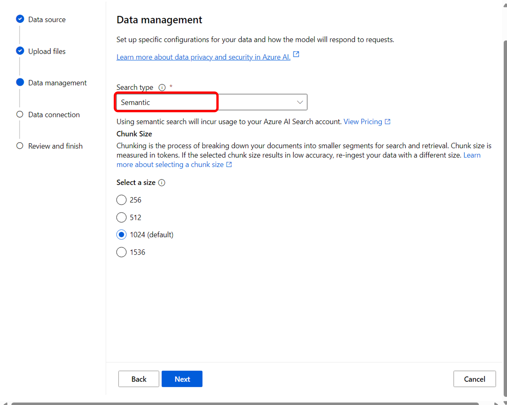

11. Data connection을 위한 Azure 리소스의 인증 타입을 "API Key"로 선택합니다.

    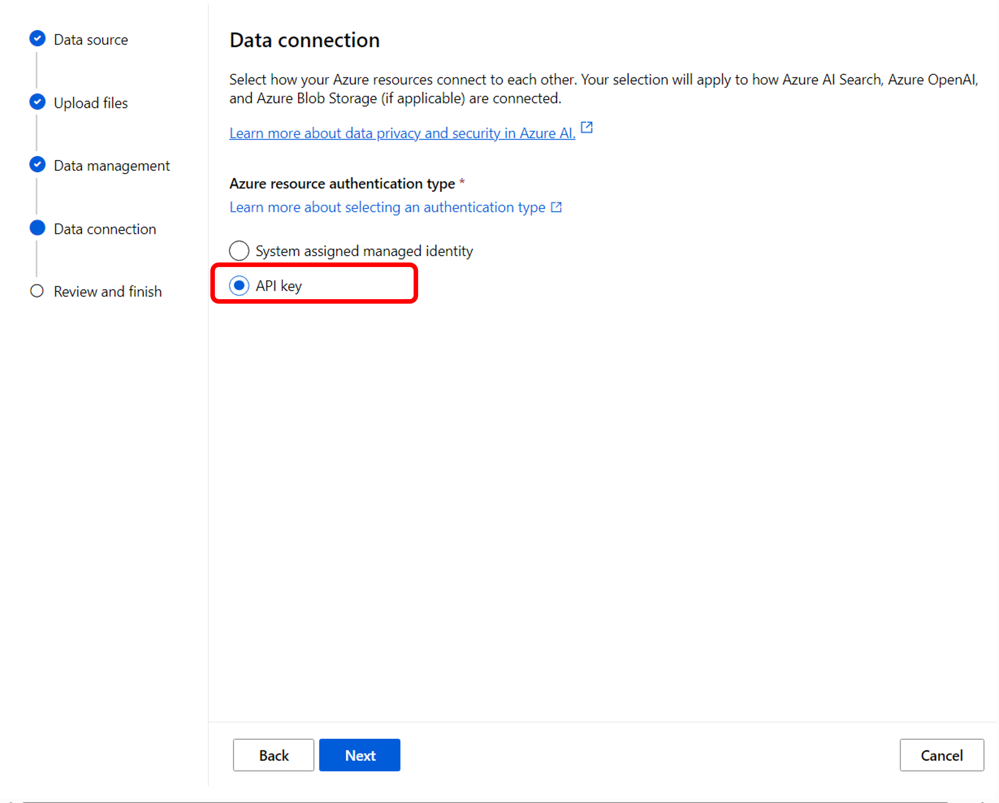

12. 설정을 리뷰한 후 "Save and close"를 클릭합니다.

    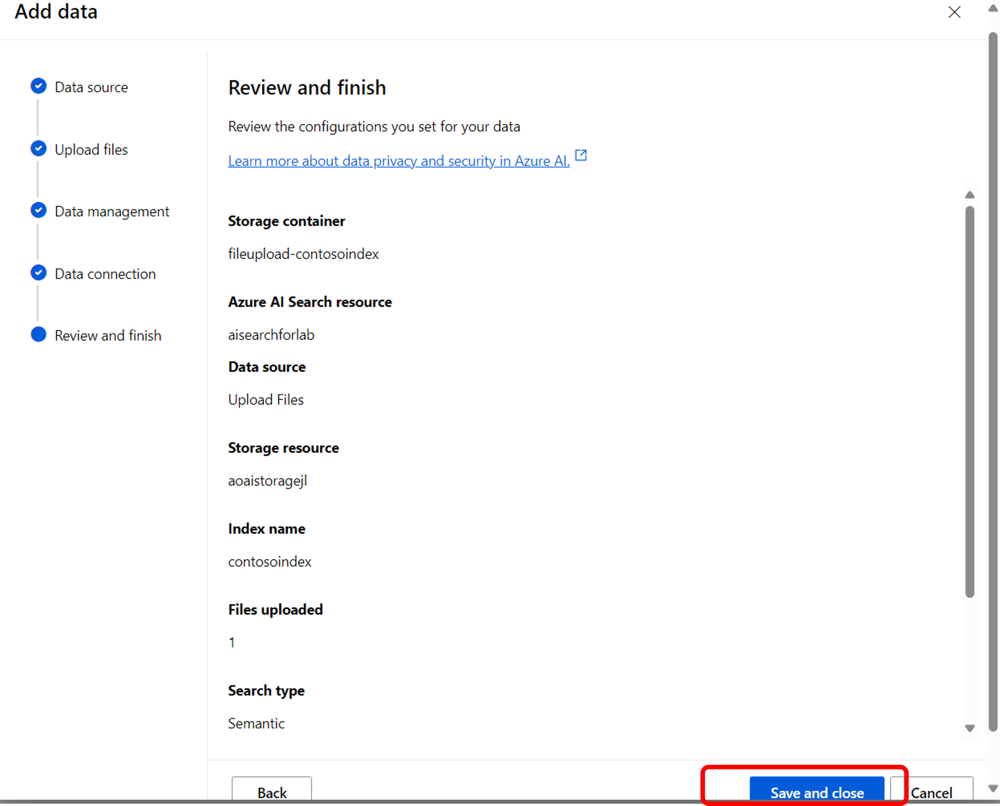

13. Chat playground에서 "Ingestion in progress"가 표시되는 것을 보실 수 있습니다. 데이터 소스 (File Upload)에서 Azure AI Search로 indexing 되고 있는 과정입니다.

    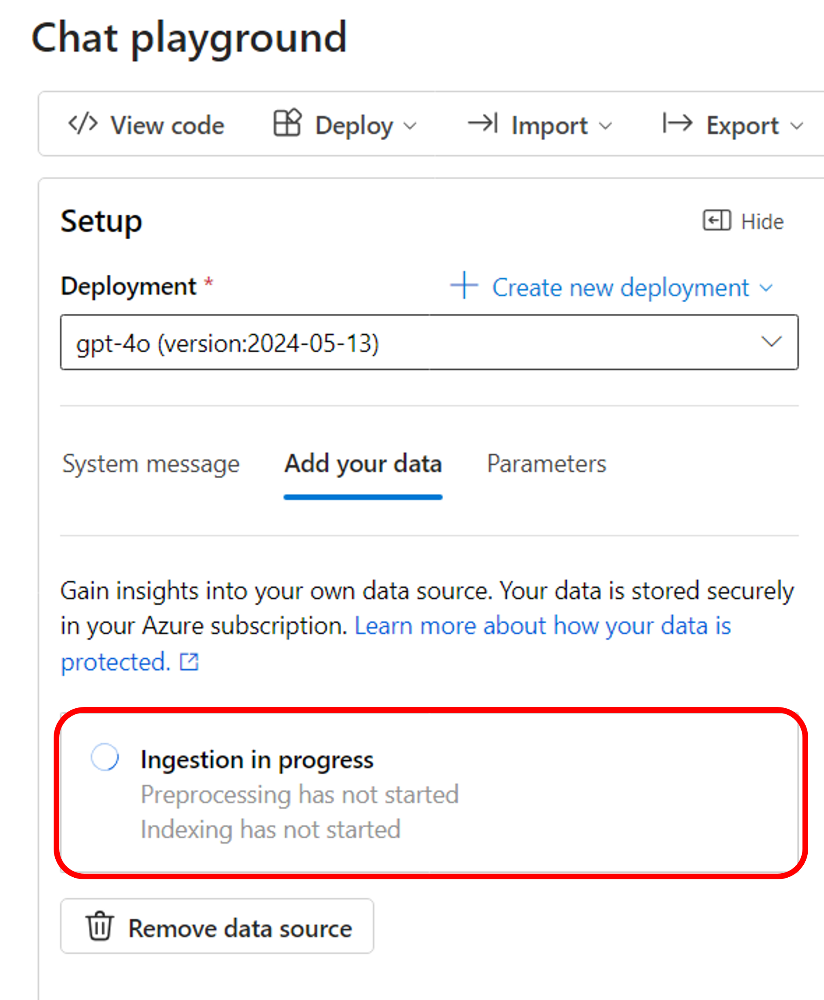

14. "Please summarize the role of vice president of operation in 3 bullets."이라는 프롬프트를 입력합니다. role_library.pdf 파일의 내용에서 응답을 주는 것을 확인할 수 있습니다.

    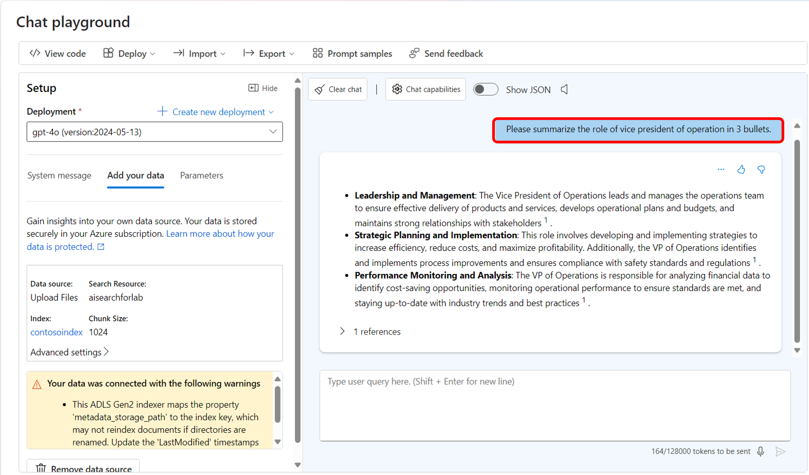