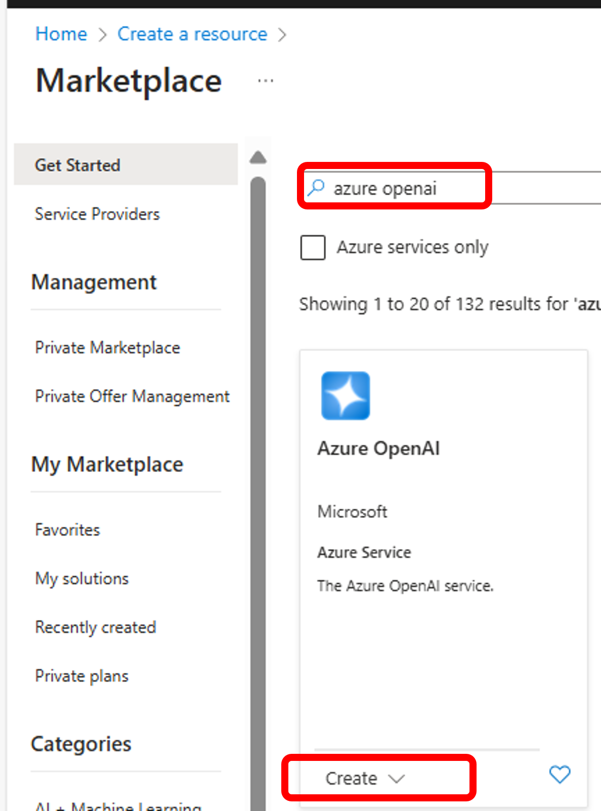
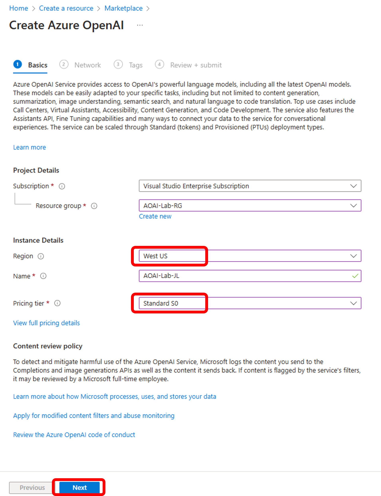

# Azure OpenAI Service 시작하기

Azure OpenAI Service를 시작하기 위하여 Azure OpenAI 리소스를 생성하고 Chat 플레이그라운드를 살펴본다.

## Azure OpenAI Service 리소스 생성

1. 아래와 같이 "azure openai"로 검색하여 Azure OpenAI 리소스를 생성합니다.

    

2. 리소스 그룹을 새로 생성하고, 지역은 "West US"를 선택합니다. 가격 티어는 "Standard S0"을 선택한 후 "Next"를 누룹니다. Network 및 나머지 과정은 디폴트 값으로 선택 후 "Review + create"를 누릅니다.

    

3. 리소스 배포가 완료되면 "Go to resource"를 클릭하여 Azure OpenAI로 이동합니다.

4. "Go to Azure AI Foundry portal을"를 클릭하여 Azure AI Foundry portal을 오픈합니다.

    

5. 모델을 배포합니다. "Deployments" 메뉴에서 "+ Deploy model"을 클릭하고 "Deploy base model"을 선택합니다.

    

6. 본 실습에서는 gpt-4o 모델을 배포하도록 하겠습니다.

    

7. Deployment name에 "gpt-4o"를 입력하고, Deployment type은 "Global Standard" 혹은 "Standard"로 선택합니다. 나머지 항목은 기본값으로 유지한 후 "Deploy" 버튼을 누릅니다.

    

## Azure OpenAI 서비스에서 채팅 플레이그라운드 살펴보기

1. [Azure OpenAI 서비스에서 채팅을 시작](https://learn.microsoft.com/ko-kr/azure/ai-services/openai/chatgpt-quickstart?tabs=command-line%2Ckeyless%2Ctypescript-keyless%2Cpython-new&pivots=programming-language-studio)해 봅니다.

## 실습 순서

* [Azure OpenAI Service 시작하기](https://github.com/jeongaelee/ProjectMooModule1/blob/main/QuickStart.md)
* [Global Batch API](https://github.com/jeongaelee/ProjectMooModule1/blob/main/Batch.md)
* [RAG를 사용한 Python 채팅 샘플 애플리케이션](https://github.com/jeongaelee/ProjectMooModule1/blob/main/RAG.md)
* [Azure OpenAI Assistants Function Calling, File Search 사용해보기](https://github.com/jeongaelee/ProjectMooModule1/blob/main/Assistants.md)
* [Azure OpenAI On Your Data - File Upload](https://github.com/jeongaelee/ProjectMooModule1/blob/main/OnYourData-FileUpload.md)
* [Azure OpenAI On Your Data - Embeddings and Search](https://github.com/jeongaelee/ProjectMooModule1/blob/main/OnYourData-EmbeddingsAndSearch.md)
