# RAG를 사용한 Python 채팅 샘플 애플리케이션

이 샘플은 검색 증강 생성(Retrieval Augmented Generation) 패턴을 사용하여 자체 데이터에 대해 ChatGPT와 유사한 경험을 만드는 몇 가지 접근 방식을 보여 줍니다.Azure OpenAI Service를 사용하여 ChatGPT 모델(gpt-35-turbo)에 액세스하고 데이터 인덱싱 및 검색을 위해 Azure Cognitive Search를 사용합니다.

리포지토리에는 샘플 데이터가 포함되어 있으므로 end-to-end로 실습을 해볼 수 있십니다. 이 샘플 애플리케이션에서는 Contoso Electronics라는 가상의 회사를 사용하여 채팅 앱을 통하여 직원들이 복리후생, 내부 정책, 직무 설명 및 역할에 대해 질문할 수 있도록 합니다.

## Objective

* Web App을 만들기 위하여 Azure CLI와 Node.js 설치
* Dev Containers 확장 설치
* 채팅 앱을 Azure에 배포하고 PDF 파일에서 답변을 얻음

### Step 1: Azure Cli 설치 및 Policy scope을 Local machine으로 설정

1. Windows 검색 창에 PowerShell을 입력하세요. PowerShell 대화 상자에서 탐색하여 관리자 권한으로 실행을 클릭하세요. 이 앱이 디바이스를 변경하도록 허용하시겠습니까? 대화 상자가 표시되면 예 버튼을 누르세요.

    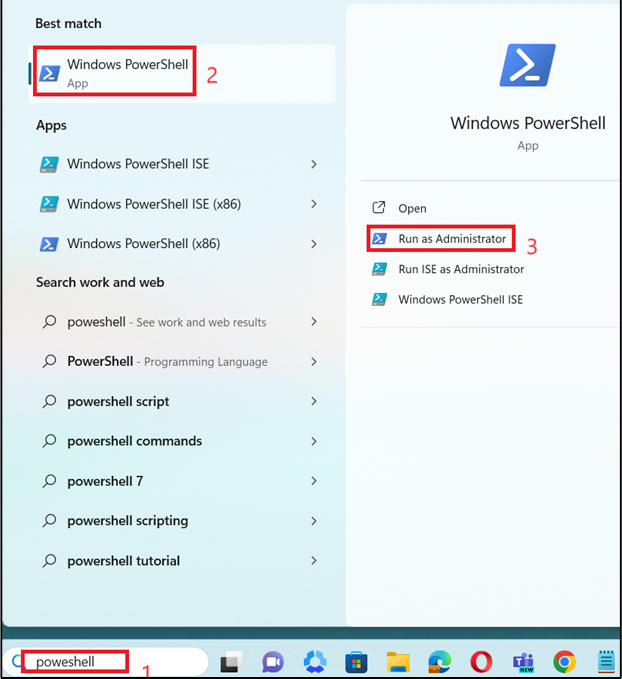

2. 다음 명령어를 사용하여 PowerShell에 Azure Cli를 설치하세요.

    ```
    winget install Microsoft.azd
    ```

    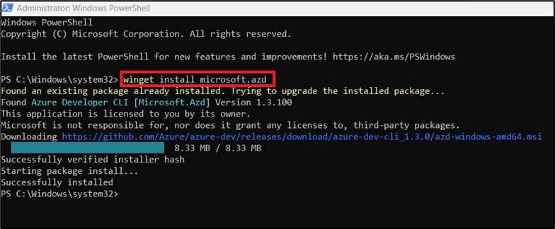

3. 아래 명령을 실행하여 정책을 무제한으로 설정하고 실행 정책을 변경하라는 메시지가 표시되면 A를 입력하세요.
    ```
    Set-ExecutionPolicy Unrestricted
    ```

    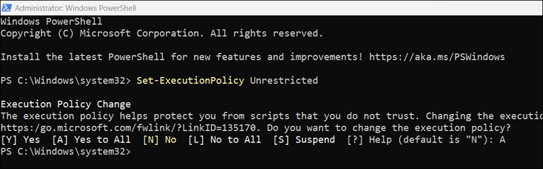

### Step 2: Node.js 설치하기

1. 브라우저를 열고 주소 표시줄로 이동하여 다음 URL(https://nodejs.org/en/download/)을 입력하거나 붙여넣은 다음 Enter 버튼을 누르세요.

2. Windows Installer를 다운로드 하고 Install 하세요.

    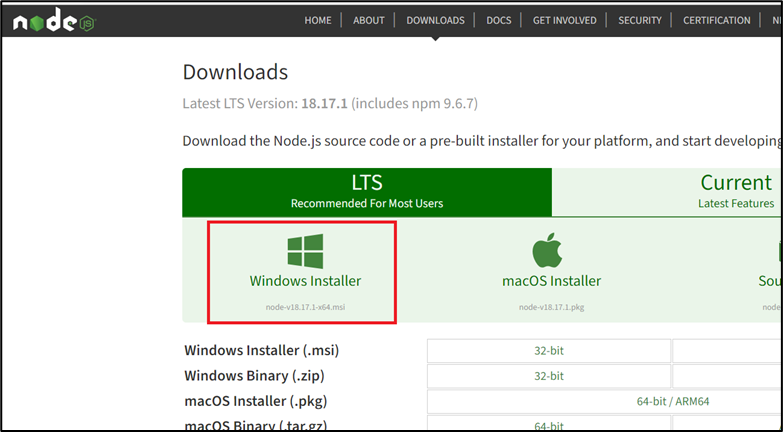

### Step 3: Docker 실행하기

1. [Docker를 Install] (https://docs.docker.com/desktop/install/windows-install/) 하고 실행 합니다.

    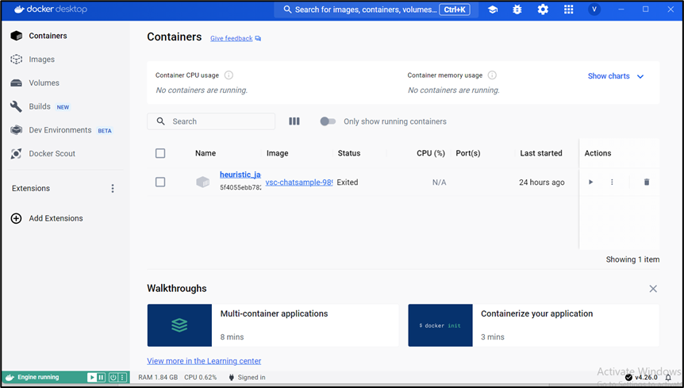

### Step 4: Dev Containers Extension 설치하기

1. Visual Studio Code를 오픈합니다.(Visual Studio Code가 설치되지 않았다면, [설치](https://code.visualstudio.com/)를 먼저 진행합니다.)

2. 브라우저를 열고 주소창에 URL (https://marketplace.visualstudio.com/items?itemName=ms-vscode-remote.remote-containers)을 입력하거나 붙여넣은 다음 Enter 버튼을 누릅니다.

3. 설치 버튼을 클릭합니다. Visual Studio Code를 열겠냐는 대화 상자가 나타나면 "Open Visual Studio Code" 버튼을 누릅니다.

    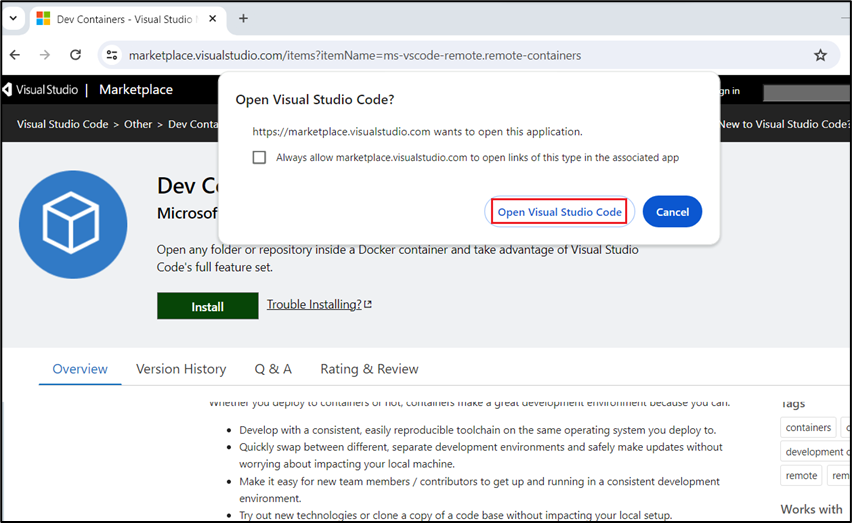

4. Visual Studio Code가 열리면, Dev Containers가 설치된 것을 확인합니다.

    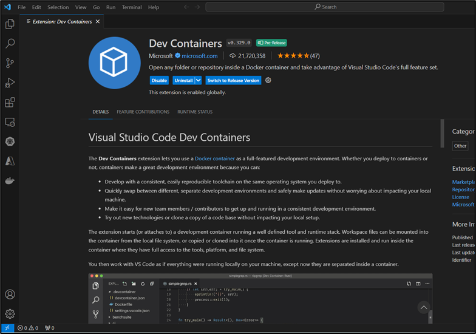

### Step 5: Open Development Environment

1. 브라우저를 열고 주소창으로 이동하여 다음 URL을 입력하거나 붙여넣으세요: 

    * https://vscode.dev/redirect?url=vscode://ms-vscode-remote.remote-containers/cloneInVolume?url=https://github.com/azure-samples/azure-search-openai-demo

2. Visual Studio Code를 열겠냐는 대화 상자가 나타나면 "Open Visual Studio Code" 버튼을 누릅니다. Dev Containers를 시작하려면 약 10~15분이 소요됩니다.
    
    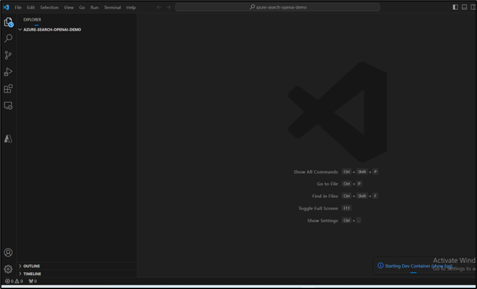

3. Dev Containers가 시작되면, Azure CLI로 Azure에 로그인을 합니다. 터미널을 열고 다음 명령을 실행하세요.

    ```
    azd auth login
    ```

4. 로그인 할 기본 브라우저가 열리면, Azure 구독 계정으로 로그인 하세요.

    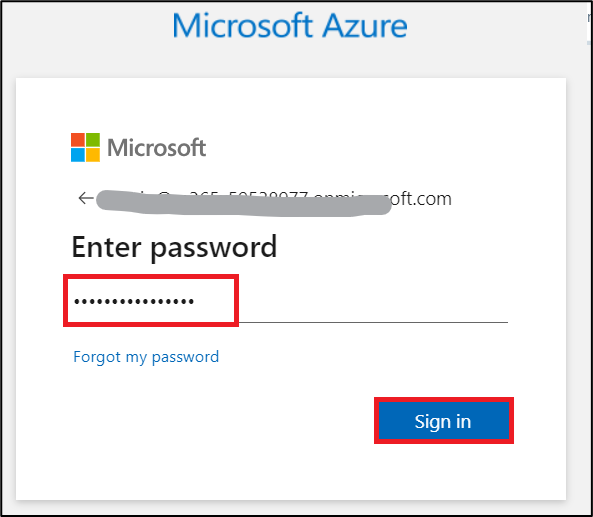

### Step 6: 채팅 앱을 Azure에 배포하기

1. 다음 Azure Cli 명령어를 터미널에서 실행하여 Azure 리소스를 프로비저닝하고 소스 코드를 배포합니다.
    ```
    azd up
    ```

    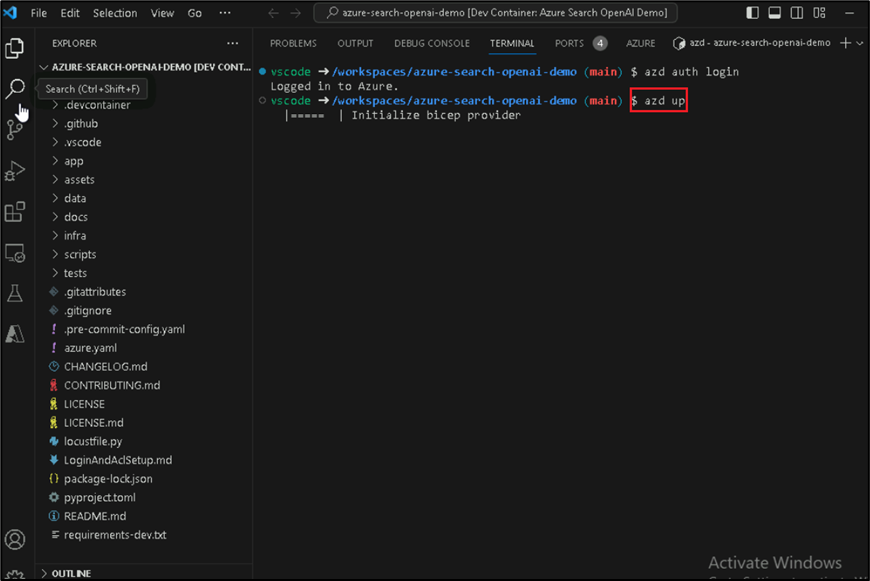

2. "Enter a new environment name:" 프롬프트가 표시되면 "chatsampleRAG"를 입력합니다.

3. 구독을 선택하라는 메세지가 표시되면, 리소스를 생성할 Azure 구독을 선택합니다.

4. 지역을 선택하라는 메세지가 표시되면, 지역은 "East US2"를 선택합니다. 이 위치는 호스팅을 포함한 대부분의 리소스에 사용됩니다.

    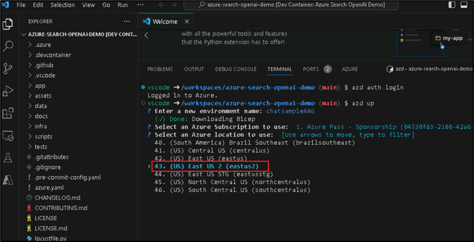

5. "save the value in the environment for future use (y/N)" 메세지가 나오면 "Y"를 입력하세요.

6. 앱이 배포될 때까지 기다립니다. 배포가 완료되려면 최대 35~40분까지 걸릴 수 있습니다.

7. 애플리케이션이 성공적으로 배포되면, 터미널에 URL이 표시됩니다.

    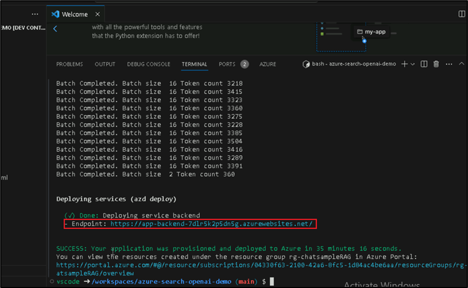

8. URL을 복사하여 브라우저에서 링크를 붙여 넣으면, 새 브라우저에서 채팅앱이 열립니다.

    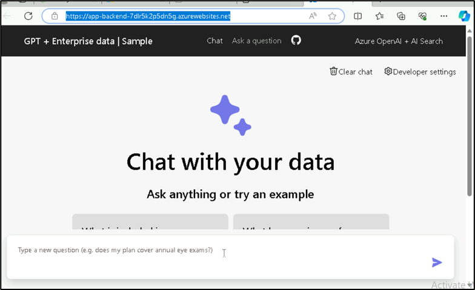

### Step 7: 채팅 앱을 사용하여 PDF 파일에서 답변 얻기

1. 앱 배포가 완료되면, 아래 화면에서 "What happens in a performence review?"라는 프롬프트를 입력합니다.

    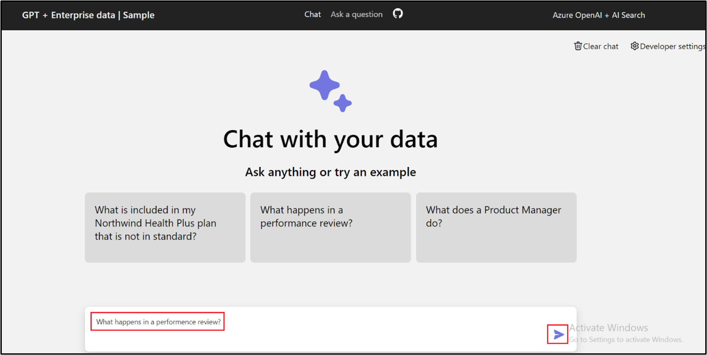

2. 답변에서 "Citation"을 선택하면, 답변이 어떻게 생성되었는지 파악할 수 있습니다.

    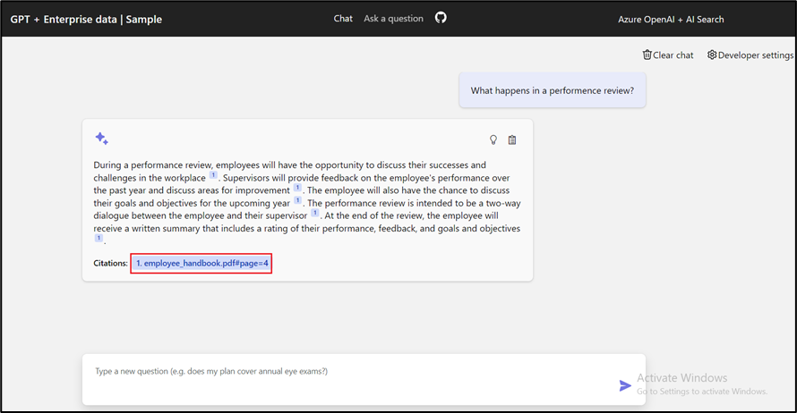

* Thought process: 이 탭은 채팅에서의 상호작용 스크립트입니다. System Prompt와 사용자 질문을 볼 수 있습니다.

    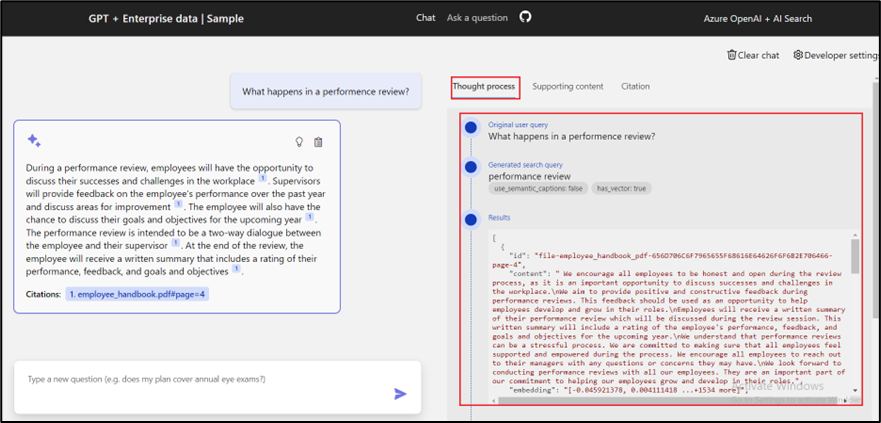

* Supporting content: 이 탭은 질문에 답변하기 위한 소스와 자료가 포함됩니다. 소스 자료 인용 횟수는 "Developer settings"에서 확인 할 수 있습니다. 기본 값은 3입니다.

    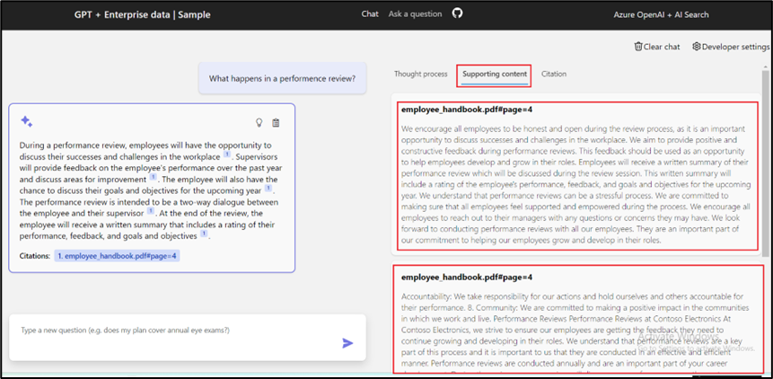

* Citation: 이 탭에서는 인용이 포함된 원본 페이지가 표시됩니다.

    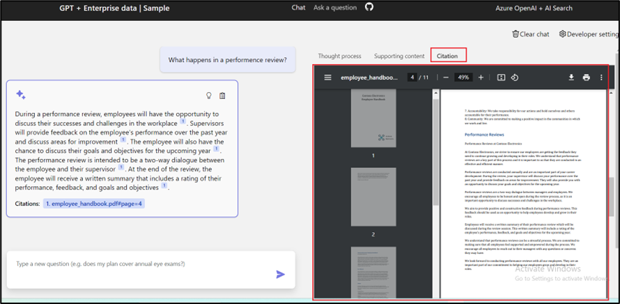

3. 채팅의 지능(Intelligence)은 OpenAI 모델과 그 모델과 상호작용하는데 사용되는 설정에 따라 결정됩니다. 채팅 앱에서 "Developer settings"를 선택합니다.

    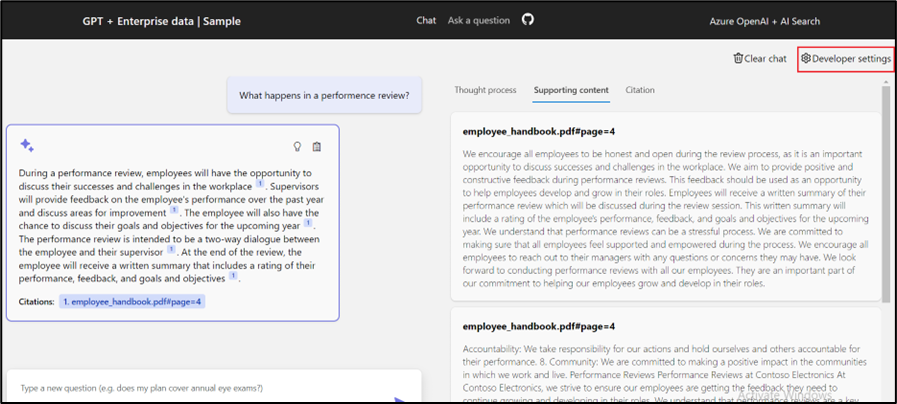

4. 각 항목의 설명은 아래와 같습니다.

    * Override prompt template: 답변을 생성하는데 사용되는 프롬프트
    * Retrieve this many search results: 답변을 생성하는데 사용된 검색 결과의 수.
    * Exclude category: 검색 결과에서 제외되는 문서의 범주
    * Use semantic ranker for retrieval: 머신 러닝을 사용하여 검색 결과의 관련성을 개선하는 [Azure AI Search](https://learn.microsoft.com/en-us/azure/search/semantic-search-overview#what-is-semantic-search)의 기능
    * Use query-contextual summaries instead of whole documents: 시맨틱 랭커 사용과 쿼리-컨텍스트 요약 사용을 모두 선택하면 LLM은 가장 높은 순위의 문서에서 모든 구절이 아닌 Key 구절에서 추출한 캡션을 사용합니다.
    * Suggest follow-up questions: 채팅 앱에서 답변에 따라 후속 질문을 제안
    * Retrieval mode: Vector + Text는 문서의 텍스트와 임베딩을 기반으로 문서를 검색합니다. Vectors는 검색 결과가 문서의 임베딩을 기반으로 한다는 의미입니다. Text는 검색 결과가 문서의 텍스트를 기반으로 한다는 의미입니다.
    * Stream chat completion responses: 응답을 위해 완전한 답변이 나올 때까지 기다리지 않고 응답

    
    
5. 아래와 같이 "Suggest follow-up questions"을 선택하고 같은 질문을 다시 합니다.

    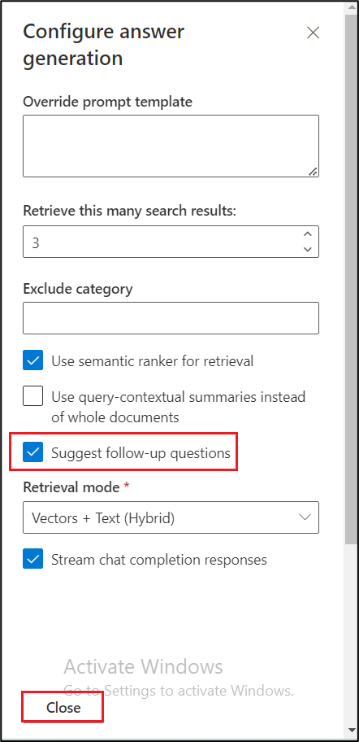

6. "What happens in a performance review?"를 입력했을때 아래와 같이 제안된 후속 질문의 리스트가 보여집니다.

    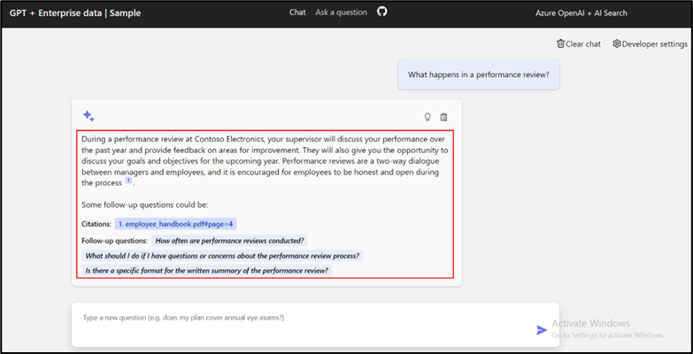

### 리소스 삭제

1. 리소스 그룹에서 "Delete resource group"을 선택하고 삭제 버튼을 누릅니다.

    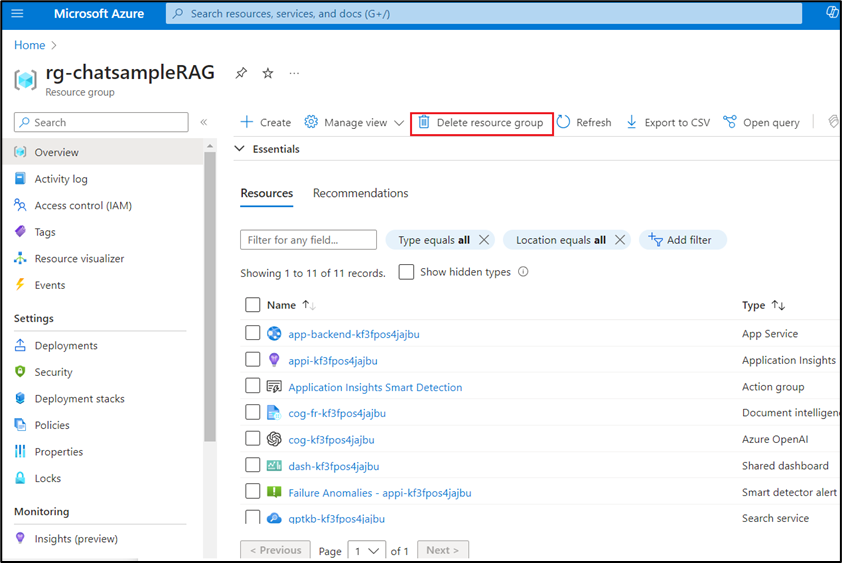


## 실습 순서

* [Azure OpenAI Assistants Function Calling, File Search 사용해보기](https://github.com/jeongaelee/ProjectMooModule1/blob/main/Assistants.md)
* [RAG를 사용한 Python 채팅 샘플 애플리케이션](https://github.com/jeongaelee/ProjectMooModule1/blob/main/RAG.md)
* [Azure OpenAI On Your Data - File Upload](https://github.com/jeongaelee/ProjectMooModule1/blob/main/OnYourData-FileUpload.md)
* [Azure OpenAI On Your Data - Embeddings and Search](https://github.com/jeongaelee/ProjectMooModule1/blob/main/OnYourData-EmbeddingsAndSearch.md)